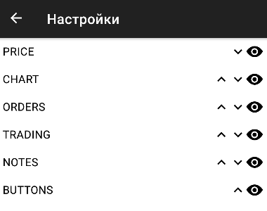
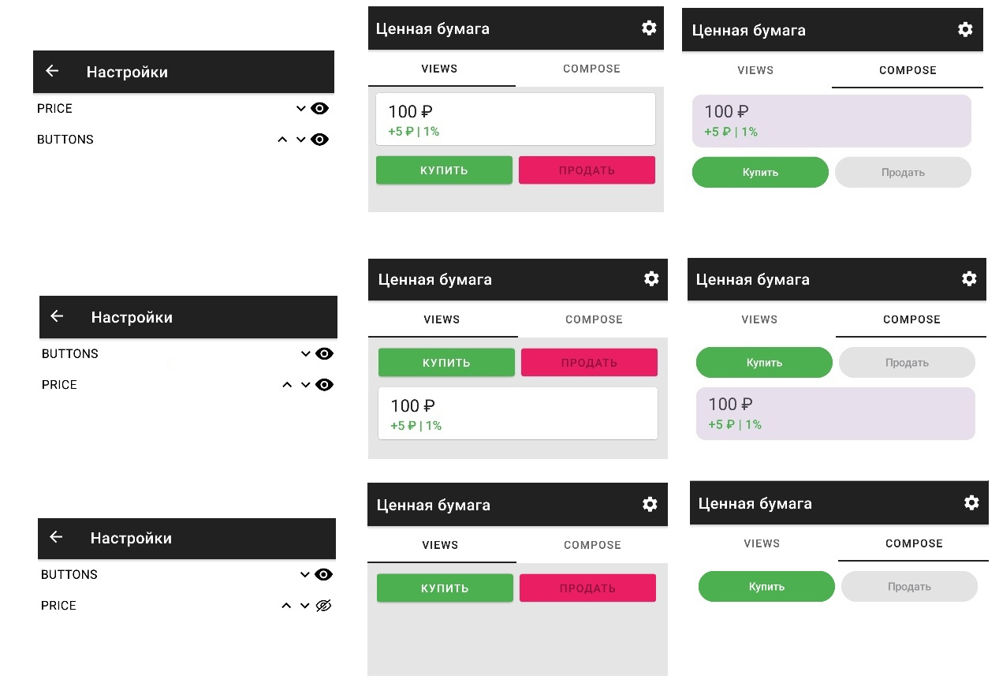

# Эксперимент "Экран с конфигурацией"

Необходимо реализовать экран карточки ценной бумаги, состав и порядок элементов 
которой можно менять с помощью динамически меняющейся конфигурации (с сервера или от пользователя). 
То есть, необходимо разработать не жестко закрепленный, а модифицирумый интерфейс. 
Такой подход актуален для проектов с высокой персонализацией или для проверки гипотез. 

### Цель

Оценить воозможность создать конфигурируемый экран с помощью Views и Compose. 

### Дано

Есть [проект](https://github.com/MobileDevelopmentUrfuAutumn2024/AdaptiveWidgetsStudy).

На главной его странице (HostFragment) есть две вкладки: Views (SerurityViewsFragment) 
и Compose (SecurityComposeFragment).  

У этих двух фрагментов одна общая ViewModel - SecurityViewModel. У нее есть два stateFlow: 

1. securityState - описывает состояние ценной бумаги. Условно, это данные, получаемые с сервера.
2. configState - описывает порядок и видимость виджетов. Задача как раз заключается в том, чтобы уметь отображать виджеты согласно этому конфигу. 

Конфиг управляется из SettingsFragment (переход по иконке настроек). Изменения автоматически 
отправляются в ScreenConfig, а оттуда - в configState в SecurityViewModel.

Для всех компонентов заготовлены их модели-состояния (SecurityState). Их менять не нужно. 

Для компонентов из задач 1-2 заготовлены разметка и привязка данных. Для Compose см. папку 
fragment/widget, для Views res/layout и fragment/bindings. 

Все, что нужно менять - классы SecurityComposeFragment и SecurityViewsFragment, плюс создавать
новое по необходимости.

### Задача 1. Рефакторинг

*Внимание!* Замеряйте время каждой задачи для Compose и для Views в минутах. 
Это не для оценки Вас, а для оценки метода. 

Проект начат неконфигуриемым. На экранах два виджета - цена (описывается PriceState) и
кнопки купить-продать (ButtonsState). Ваша задача - отрефакторить проект так, чтобы 
видимость и положение этих двух виджетов повиновалось изменениям в настройках, вот так:  

В отчет запишите видео, в котором при переходе из настроек меняется порядок и видимость элементов,
как на схеме выше. Запишите время, которые вы потратили на реализацию Views и Compose *отдельно*.

### Задача 2. Добавление

В проекте заготовлены еще две разметки - для графиков (CHART) и для заявок (ORDER). Ваша задача - 
всего лишь встроить их в вашу систему, полученную в задаче 1. После решения задачи 2 экран 
принимает следующий вид: 

В отчет запишите видео, как управляются два добавленных элемента через настройки. Обратите внимание:
график занимает всю ширину экрана, и если он первый на экране, у него не должно быть отступа сверху:

Запишите время, которые вы потратили на **добавление** в случаях Views и Compose *отдельно*.

### Задача 3. Создание

Для элементов заметок (NOTES) и инфорации о торгах (TRADES) реализованы модели, но разметка - нет. 
Создайте разметки этих элементов во Views и Compose и добавьте к ранее реализованным собратьям. 

Макеты для этих экранов: 

**Информация от торгах:**

Названия полей - хардкод, значения - из TradingState (open, close, hign, low - по порядку). 
Обратите внимание: поля могут не влезать, но две колонки должны оставаться на своих местах,
занимая половину плашки. Поэтому подобрезаем невлезающее. 

**Заметки**

Заметки берем из NotesState, поля notes. Показываем не все, а сколько указано в displayCount. 
Это значит, что количество это может меняться, поэтому просто сделать два текста в разметке 
недостаточно. 

В отчет запишите видео, как управляются два добавленных элемента через настройки. 
Запишите время, которые вы потратили на **создание** этих двух элементов в случаях Views и Compose *отдельно*.

### Сдача

Просуммируйте время, затраченное на Views- и на Compose-реализации. Если делали что-то нужное 
для реализации кроме задач, добавьте это время. 

Разработка ведется в отдельной ветке - затем вы делаете pull-реквест в мастер. 
К пулл-реквесту в комментарий приложить: 

1. Видео работы всех трех задач;
2. Скрин о прохождении опроса [ссылка](https://forms.yandex.ru/cloud/6748a4eb6d2d7304c2b36b42/)

