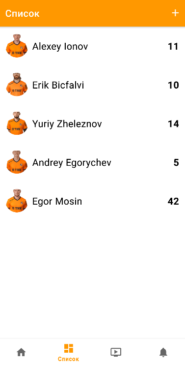
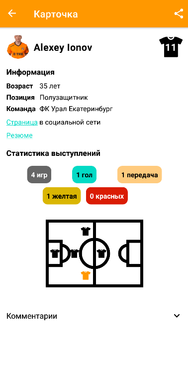

# Практика "Список с деталями"

Первая практика их серии, в которой вам предстоит поработать с большим количеством экранов 
и навигацией.

### Что предстоит изучить
- Single Activity - строим на фрагментах или compose-скринах
- Нижняя навигация 
- Списковые представления
- Навигация и передача данных между экранами

### Выбор предметной области
Выберите вариант практики:
 
- Репозитории из Github (https://docs.github.com/en/rest/repos)
- Фильмы (https://kinopoisk.dev/ https://imdbapi.dev/ etc)
- Много открытых API: https://github.com/public-api-lists/public-api-lists
- Свой вариант

Общая схема: имеется список элементов, из него происходит переход к деталям. 

В рамках этой практики вам не нужно будет реализовывать обращение к сервисам. Подготовим 
экраны для этих запросов. Определите данные, которые можно получить, посмотрите, что вы вынесете
в список, а что - в экран деталей. В рамках этой практики данные грузить не надо, только подготовить модели и интерфейс (на моковых данных)

### На чем пишем 
В прошлой практике вы попробовали views и compose. Здесь выбор за вами, что использовать, но
что-то одно. 

Для реализации экранов используйте фрагменты или compose. 

Для навигации:
 
*Фрагменты:*
- Nav Component https://developer.android.com/guide/navigation
- Cicerone https://github.com/terrakok/Cicerone

*Compose:*
- navigation-compose https://developer.android.com/develop/ui/compose/navigation
- Modo https://github.com/ikarenkov/Modo
- Navigation 3 https://developer.android.com/guide/navigation/navigation-3

Можно использовать другие библиотеки, если есть опыт.

**Решение должно использовать паттерн проектирования, MVVM при Compose, MVP/MVVM при Views.**
https://docs.google.com/presentation/d/1vr1eXMZTBEFaYLy2tfzxeeT6dFvnntD9i39A3momRKQ/edit?usp=sharing
ViewModel https://developer.android.com/topic/libraries/architecture/viewmodel
Moxy (MVP) https://habr.com/ru/articles/276189/

### 1. Нижняя навигация

Корневым элементом навигации будет BottomNavigationBar, на первом листе которого будет 
ваш список с деталями. Другие листы реализуем позже.

*Пример реализации*

https://developer.android.com/reference/com/google/android/material/bottomnavigation/BottomNavigationView
https://scoder17.hashnode.dev/bottom-navigation-bar-in-jetpack-compose

### 2. Список 

Реализуйте список ваших элементов. Их может быть много, поэтому используйте оптимизируемые
решения: 

*RecyclerView*

https://habr.com/ru/articles/705064/

https://developer.android.com/develop/ui/views/layout/recyclerview

*Lazy Column*

https://metanit.com/kotlin/jetpack/2.6.php

https://developer.android.com/develop/ui/compose/lists#lazy

### 3. Экран с деталями

При нажатии на элемент списка должен происходить переход на экран с деталями
элемента. 

Способ передачи данных зависит от выбранной библиотеки. На экране деталей постарайтесь сделать сложную разметку, например требующую
применения Constraint Layout ([views](https://developer.android.com/develop/ui/views/layout/constraint-layout)
, [compose](https://developer.android.com/develop/ui/compose/layouts/constraintlayout))

### Сдача 
Прикрепите запись экрана, где будет показана работа нижней навигации (переключение экранов),
работа списка, переход на экран деталей и обратно. Работайте в отдельной ветке, 
создавайте merge request и прикрепляйте ссылку на него в [таблицу](https://docs.google.com/spreadsheets/d/14sYlIETeD42pZADhAp7ehKcnl5Ms2v2hhikR6PAkIO8/edit?usp=sharing)

### Что будет дальше
В рамках следующих практик (читай - здесь не нужно) вы будете получать данные из сети, 
запоминать настройки от пользователя. 
