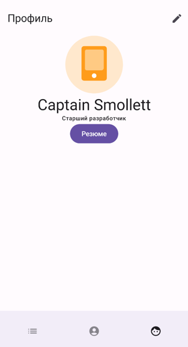
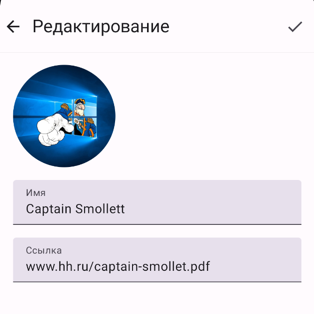

# Практика "Профиль"

Практика, посвященная работе с файлами. Реализуйте в вашем приложении вкладку "Профиль". 
Она будет отражать профиль пользователя и состоять из двух экранов: 

1. Сам по себе профиль

2. Редактирование профиля

Профиль хранится в памяти телефона. 
Оцените, какой способ хранения подойдет для структуры профиля, который должен содержать:

1. ФИО;
2. URI фотографии (аватарки) на устройстве;
3. URL на резюме/портфолио в сети в виде файла, например pdf;
4. Дополнительные поля по желанию - должность и т.д. 

Именно эти поля мы и заполняем в экране редактирования (в него мы попадаем из профиля, в примере кнопка "карандаш"). 
Реализуйте текстовые поля для ФИО и ссылки на резюме, а также картинку с аватаркой, при нажатии 
на которую будет предоставлен выбор, откуда взять новую аватарку: из галереи или с камеры. 

Позаботьтесь о запросе разрешений (permission) для выбора фото и фотосъемки. Проверьте работу приложения 
на разных версиях Android. 

При нажатии кнопки "Готово" в редактировании мы выходим на экран профиля и изменения там применяются автоматически.
При нажатии на кнопку "Резюме" документ по ссылке скачивается и показывается в файловом менеджере/просмотрщике. 

### Отчет

К пулл-реквесту с кодом приложить запись экрана со следующим сценарием: 

1. Профиль (изначально может быть пустым) ->
2. Редактирование профиля -> 
3. Запрашивается доступ на доступ к файловому хранилищу (стандартный диалог). Если юзер не разрешил доступ, выходим с экрана. ->
4. Нажатие на фото, показ выбора - Галерея или Камера. ->
5. Выбрать Галерея, выбрать фото из галереи. Оно должно показаться в интерфейсе. ->
6. Повторить тоже самое для случая с камерой ->
7. Ввод имени и ссылки на резюме/портфолио ->
8. Нажатие на кнопку "Готово" -> Выход в Профиль. Он заполнен тем, что мы ввели.
9. Нажатие на "Резюме" -> переход к скачанному файлу. 

Применяйте принципы, изученные ранее - логика выносится во VievModel/Presenter, соблюдается CleanArchitecture. 
