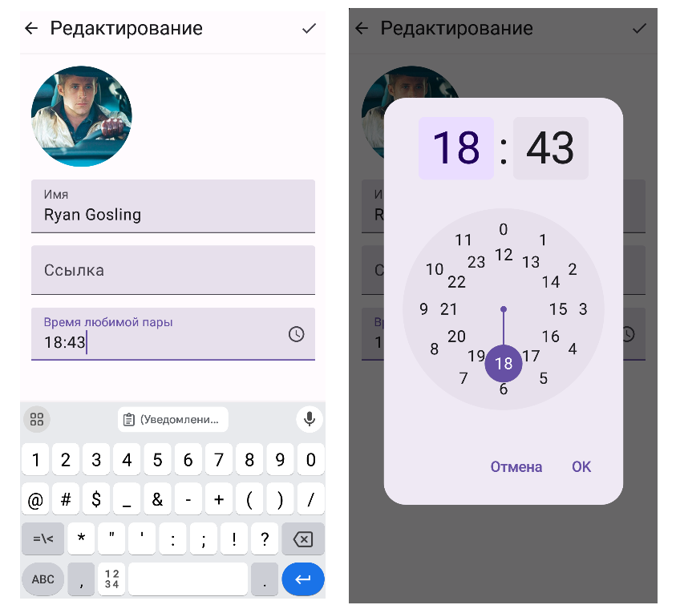
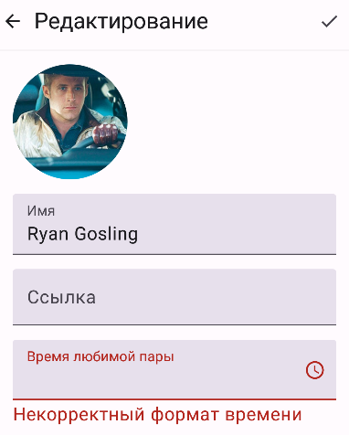
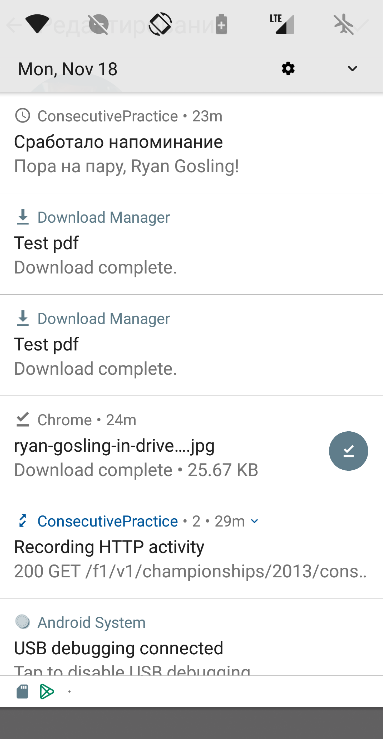

# Практика "Время любимой пары" (Уведомления)

Теперь в профиле можно будет поставить напоминание о начале любимой паре по мобильной разработке!
(или о чем угодно). Для этого нужно научиться отправлять и принимать пуш-уведомления.

### Задача

Добавьте в экран редактирования профиля из прошлой практики новое поле - "Время любимой пары".
Его можно будет заполнить как с клавиатуры, так и с виджета часов (при нажатии на иконку). 

Поле должно валидироваться: в случае, если поле не заполнено или там какая-то ерунда, а не время 
в формате HH:mm, должна показываться ошибка, а сохранение недоступно:

В установленное время на устройстве должно появиться пуш-уведомление, которое уведомляет 
о начале пары владельца профиля (имя, указанное во время установки уведомления). Дата срабатывания -
сегодняшний день, но по желанию можно добавить поле вводы даты. 

По нажатию на push-уведомление открывается наше приложение. 

### Что использовать

BroadcastReceiver, AlarmManager, NotificationManager, NotificationChannel, Intent, TimePicker

### Сдача 

К пулл-реквесту приложите видеозапись с:

1. Заполнением поля времени вручную
2. Заполнением поля времени с часов
3. Срабатыванием валидации на формат времени
4. Показ пуш-уведомления в установленное время
5. Открытие приложения по нажатию на пуш